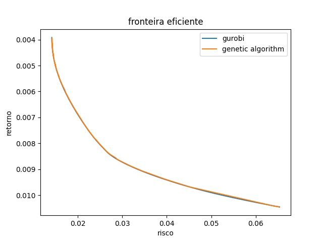

# markowitz optimization

Aplicação do método de soma ponderada para resolver o problema de otimização de markowitz e gerar a fronteira eficiente
variando os pesos.

## Solução Gurobi
Usamos os dados de preço em input_data e geramos a fronteira eficiente (obs: a coordenada y dos retornos está 
invertida pois resolvemos o problema biobjetivo por minimização). Utilizamos a variância como proxy de risco pois 
o solver gurobi não consegue otimizar raizes quadradas, e a média dos retornos como proxy de retorno.

## Solução Algoritmo Genético
Também foi desenvolvido um algoritmo genético para ser comparado a solução encontrada pelo gurobi. Para o algoritmo
genético utilizamos o desvio padrão como proxy de risco e a média dos retornos como proxy de retorno.

## comparaçao entre as soluções
Podemos ver que a fronteira eficiente gerada otimizando variância ou desvio padrão é a mesma, ainda que os pontos sejam
diferentes.
